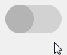

.. _api:

========================
MSL-Qt API Documentation
========================

The root package is

.. autosummary::

    msl.qt

which has the following modules

.. autosummary::

   msl.qt.io
   msl.qt.prompt
   msl.qt.exceptions
   msl.qt.utils

the following general :class:`QWidget`\'s

.. autosummary::

   ~msl.qt.button.Button
   ~msl.qt.logger.Logger
   ~msl.qt.toggle_switch.ToggleSwitch

the following :class:`QWidget`\'s that are compatible with the `MSL Equipment`_ package

.. autosummary::

   ~msl.qt.equipment.configuration_viewer.ConfigurationViewer
   ~msl.qt.equipment.message_based.MessageBased
   ~msl.qt.equipment.thorlabs.translation_stage.TranslationStage

and the following convenience classes

.. autosummary::

   ~msl.qt.loop_until_abort.LoopUntilAbort
   ~msl.qt.utils.Sleep

Package Structure
-----------------

.. toctree::
   :maxdepth: 1

   msl.qt <_api/msl.qt>
   msl.qt.io <_api/msl.qt.io>
   msl.qt.button <_api/msl.qt.button>
   msl.qt.exceptions <_api/msl.qt.exceptions>
   msl.qt.logger <_api/msl.qt.logger>
   msl.qt.loop_until_abort <_api/msl.qt.loop_until_abort>
   msl.qt.prompt <_api/msl.qt.prompt>
   msl.qt.toggle_switch <_api/msl.qt.toggle_switch>
   msl.qt.utils <_api/msl.qt.utils>
   msl.qt.equipment <_api/msl.qt.equipment>

.. _MSL Equipment: http://msl-equipment.readthedocs.io/en/latest/